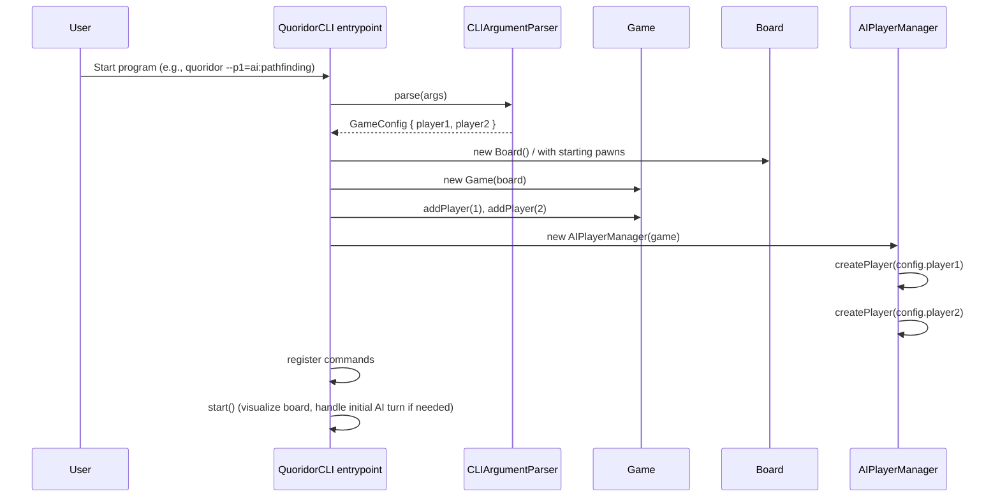
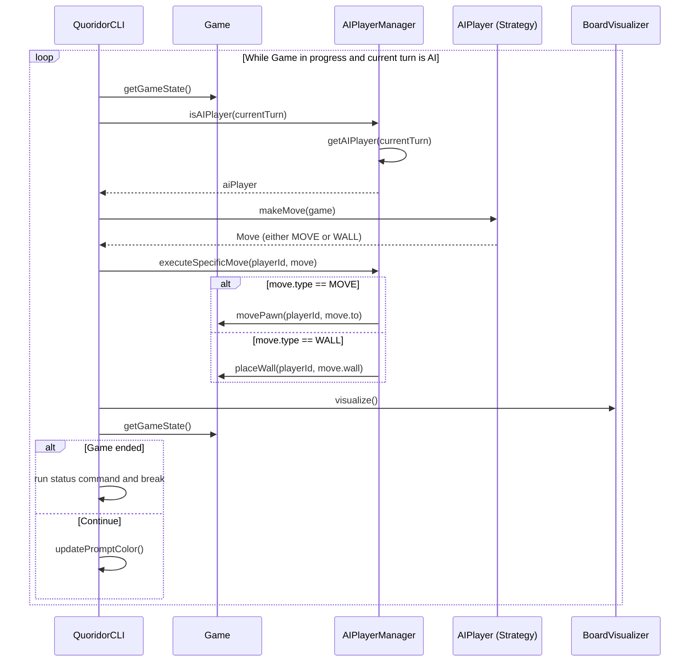
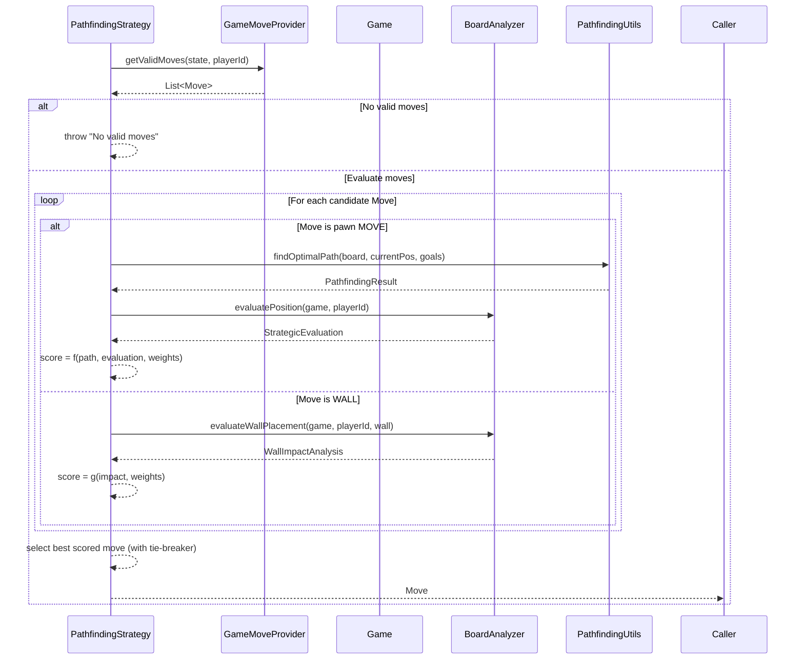
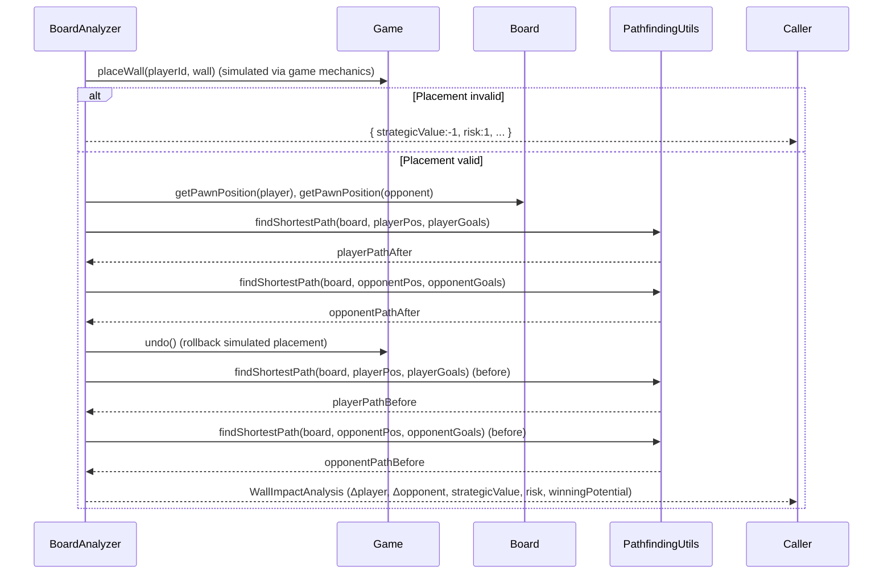
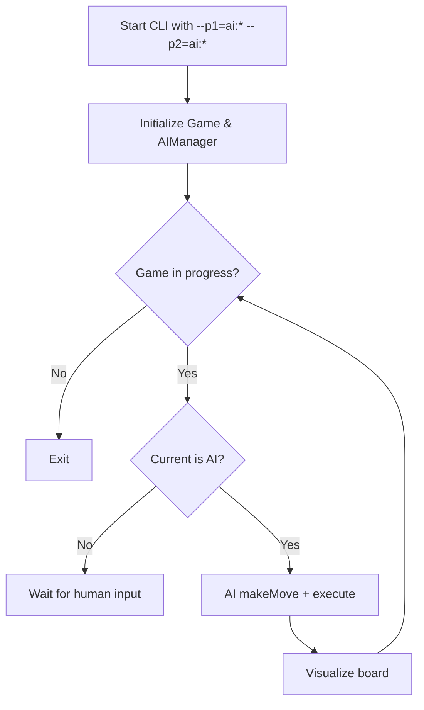

# AI-Based Flows

This document focuses on AI-driven flows, from CLI configuration through move calculation and execution.

## Game Startup and AI Configuration

The following sequence diagram shows how the CLI parses arguments, configures players (human and AI), and starts the interactive loop.

### Flow Description

1. CLI parses --p1/--p2 into a GameConfig via CLIArgumentParser
2. A default Board and Game are initialized with starting pawns and two players
3. AIPlayerManager creates AI players based on the configuration (human vs AI, AI vs AI)
4. CLI registers commands then starts the prompt, running an initial AI turn if the current player is AI

## AI Turn Execution Flow (From CLI)

The following sequence shows how an AI turn is executed automatically by the CLI while the game is in progress.

### Flow Description

1. CLI polls current GameState and checks if it is an AI turn
2. The AI player is retrieved from AIPlayerManager
3. The AI computes a Move and the CLI executes that exact move through AIPlayerManager
4. The board is visualized and the state is updated
5. Loop continues until either turn switches to human or the game ends

## AI Move Calculation (Pathfinding Strategy)

This diagram breaks down how an AI using the PathfindingStrategy determines its move.

### Flow Description

1. Strategy asks GameMoveProvider for all valid moves in the current state
2. For pawn moves, Strategy uses PathfindingUtils to estimate path efficiency and BoardAnalyzer to evaluate strategic posture
3. For wall moves, Strategy requests BoardAnalyzer to evaluate wall impact, risk, and winning potential
4. Each move receives a score using configured evaluation weights; the top move is selected (deterministically with a tie-breaker)

## Wall Placement Impact Evaluation (Analyzer)

This sequence shows how BoardAnalyzer simulates a wall placement and measures its impact.

### Flow Description

1. Analyzer attempts to place the wall using the actual game mechanics; invalid placements return a conservative negative evaluation
2. On valid placement, Analyzer measures path lengths before/after for both players and computes an impact delta
3. It derives strategicValue, riskAssessment, and winningPotential from those deltas
4. The analyzer undoes any simulated wall placement to leave the game state unchanged

## AI vs AI Loop (Optional)

When both players are AI, the CLI continues alternating AI turns until the game ends.

### Flow Description

- Both players are AI; the CLI loops through handleAITurns until GameStatus != IN_PROGRESS
- Each iteration fetches a move from the respective strategy and executes it via the game engine

---

Notes:
- These flows reflect current semantics: Game orchestrates rule enforcement and history; Board validates moves and walls; AI strategies are pure consumers of the current game/board state.
- The diagrams mirror the style of docs/main_flows.md, using sequence diagrams and flowcharts with a short description for each flow.
