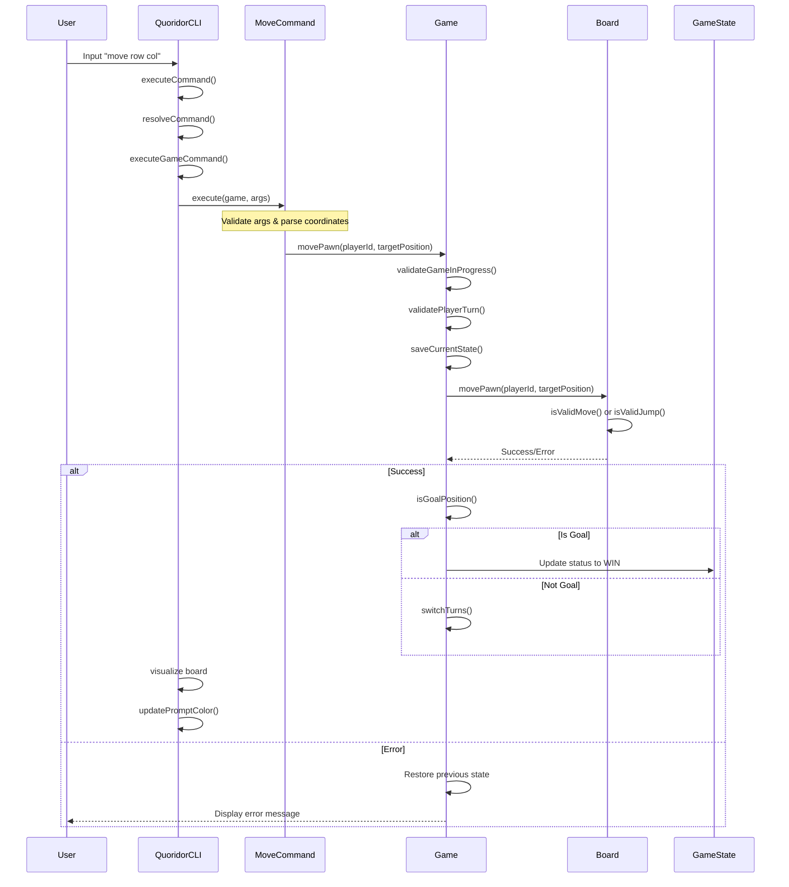
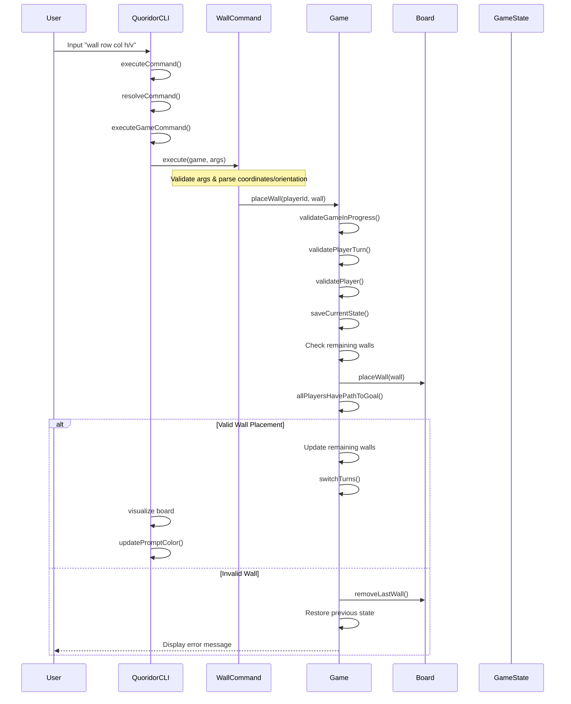
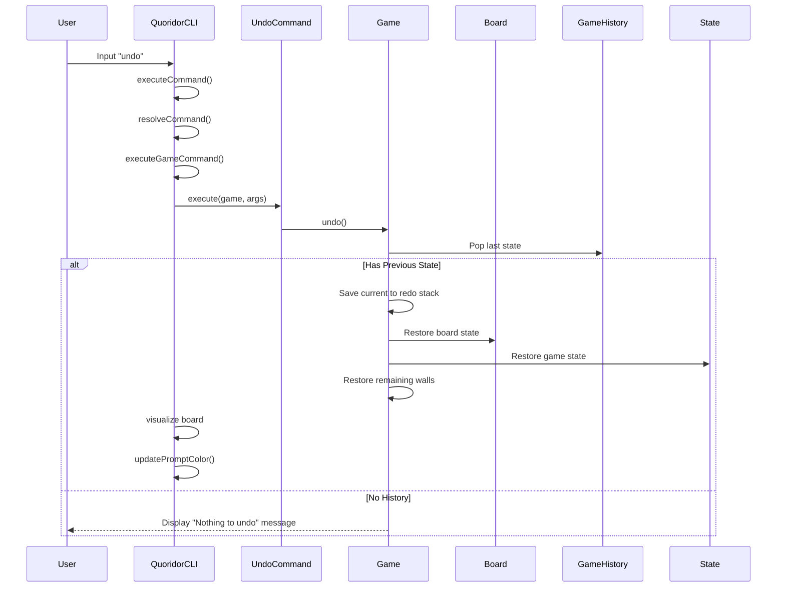

# Main Command Flows

## Move Command Flow

The following sequence diagram shows the flow of control when a player executes a move command in the game.

### Flow Description

1. User enters the move command with row and column coordinates
2. CLI processes the command through its command resolution system
3. The MoveCommand handler validates input and parses coordinates
4. Game engine validates game state and player turn
5. Current state is saved for potential rollback
6. Board validates and executes the move
7. On success:
   - Checks if move results in win
   - Updates game state
   - Switches turns
   - Updates visualization
8. On error:
   - Restores previous state
   - Shows error message to user 

## Wall Command Flow

The following sequence diagram shows the flow of control when a player places a wall.

### Flow Description

1. User enters the wall command with row, column and orientation (h/v)
2. CLI processes the command through its command resolution system
3. The WallCommand handler validates input and creates wall object
4. Game engine performs validations:
   - Game in progress
   - Player's turn
   - Player has walls remaining
5. Current state is saved for potential rollback
6. Board places the wall and validates:
   - Wall position is valid
   - All players still have path to goal
7. On success:
   - Updates remaining walls count
   - Switches turns
   - Updates visualization
8. On error:
   - Removes placed wall
   - Restores previous state
   - Shows error message to user

## Undo Command Flow

The following sequence diagram shows the flow of control when a player undoes their last move.

### Flow Description

1. User enters the undo command
2. CLI processes the command through its command resolution system
3. The UndoCommand handler triggers game's undo operation
4. Game engine checks for available history
5. If history exists:
   - Saves current state to redo stack
   - Restores previous board state
   - Restores previous game state
   - Restores previous wall counts
   - Updates visualization
6. If no history:
   - Shows error message to user 